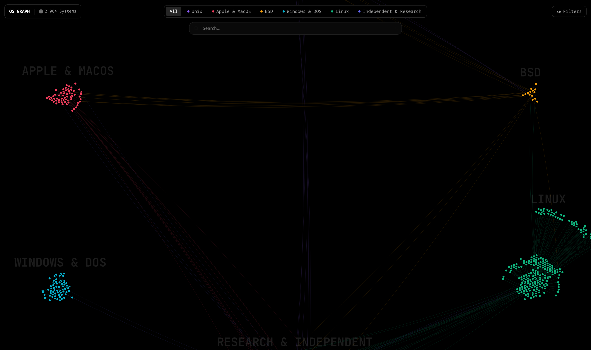
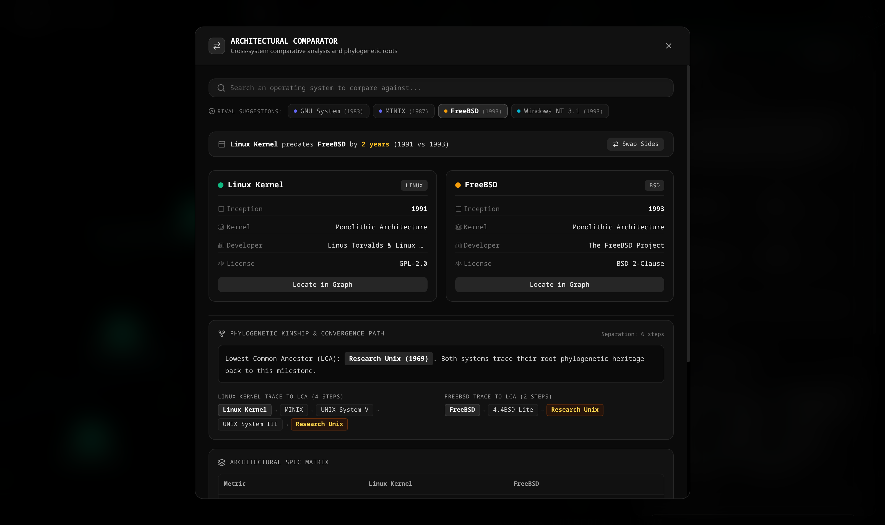
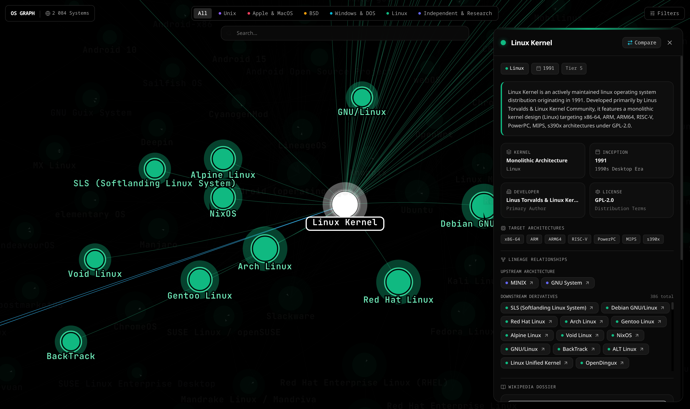
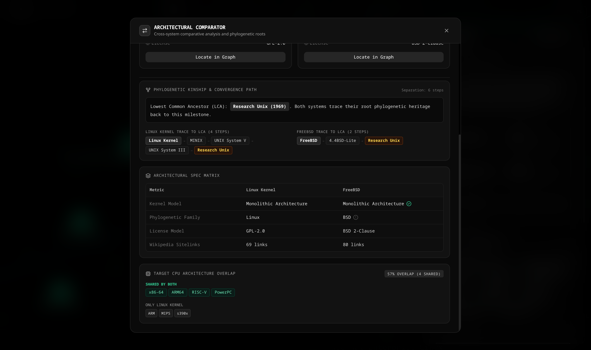

<div align="center">
  <picture>
    <source media="(prefers-color-scheme: dark)" srcset="docs/images/osgraph-banner-dark.svg">
    <source media="(prefers-color-scheme: light)" srcset="docs/images/osgraph-banner-light.svg">
    
  </picture>


  <p align="center">
    <strong>Explore the phylogenetic evolutionary tree of 2,083 operating systems with high-density architectural metrics, Lowest Common Ancestor (LCA) convergence paths, and real-time historical intelligence.</strong>
  </p>

  <p align="center">
    <a href="https://jovanjorelli.github.io/OS-Graph/"></a>&nbsp;
    <a href="#features"></a>&nbsp;
    <a href="versions/"></a>&nbsp;
    <a href="LICENSE"></a>
  </p>

  <p align="center">
    &nbsp;
    &nbsp;
    &nbsp;
    &nbsp;
    &nbsp;
    
  </p>

  <br />

  
</div>

---

## Overview

**OS-Graph** is an interactive, browser-native phylogenetic visualization and comparative intelligence engine mapping over 2,083 operating systems spanning more than seven decades of computer science history (1950–Present).

Traced across 1,490 evolutionary connections, the platform charts the branching pathways of Unix, BSD, Linux, Windows/DOS, Apple/macOS, and historic research platforms. It uncovers evolutionary lineages, calculates Lowest Common Ancestors (LCA) between distinct architectures, identifies CPU Instruction Set Architecture (ISA) overlaps, and streams live historical summaries directly into a cyber-styled interface without external backend dependencies.

> [!NOTE]
> **Data Provenance & Disclaimer**: All historical timelines, kernel taxonomies, licensing metadata, and system abstracts are ingested directly from public Wikidata and Wikipedia APIs. While systematically curated and filtered, community-maintained Wikipedia entries may occasionally contain chronological discrepancies, disputed lineage attributions, or incomplete records.


---

<a id="features"></a>
## Key Features

### High-Throughput Canvas 2D Spatial Engine
- **Spatial Hash Grid Indexing**: Custom $O(1)$ uniform bucket spatial grid eliminates linear searching across 2,083 nodes on pointer movements, maintaining fluid 60/120 FPS interaction.
- **Viewport-Aware Frustum Culling**: Off-screen elements and subpixel labels are dynamically culled before paint cycles.
- **Dynamic Particle Filaments**: Directed animated particles illustrate downstream lineage propagation between ancestor and derivative operating systems.
- **Micro-Quantized Font Cache**: Pre-computed typography lookup tables eliminate runtime string allocations during high-speed zooming and panning.

### Architectural Comparator & LCA Phylogenetic Paths
- **Lowest Common Ancestor (LCA) Resolution**: Instantaneously determines the closest shared milestone system between any two selected operating systems.
- **Step-by-Step Phylogenetic Trace**: Renders interactive lineage breadcrumbs displaying exact generation counts from both systems to their evolutionary junction.
- **Temporal Delta Analysis**: Computes generational age disparity with relative inception metrics.
- **Curated & Sibling Rival Suggestions**: One-click benchmark chips recommended dynamically based on shared heritage and historical significance.
- **Bidirectional Swapping**: Instantly exchange primary and comparative subjects with synchronized state recomputation.



### Deep System Inspector Drawer & Wikipedia Intelligence
- **Live Wikipedia Integration**: Directly pulls verified encyclopedic abstracts, licensing profiles, and developer metadata with local fallback caching.
- **Historical Epoch Classification**: Automatically maps system launch dates into defined eras (e.g. `1970s Pioneer Era`, `1990s Desktop Era`, `2000s Web Era`, `2020s Modern Era`).
- **Interactive Lineage Trees**: Quick-pivot chips for all direct upstream roots and downstream distributions.
- **Target CPU ISA Badging**: Full breakdown of supported architectures (`x86-64`, `ARM`, `RISC-V`, `MIPS`, `PowerPC`, `s390x`).



### Architectural Spec Matrix & CPU ISA Overlap
- **Direct Side-by-Side Matrix**: Compares kernel architectures (`Monolithic`, `Microkernel`, `Hybrid`, `Exokernel`), phylogenetic families, software licenses, and community visibility.
- **Processor ISA Overlap Quantification**: Calculates exact hardware portability overlap percentages and distinguishes exclusive target platforms.



### Multi-Dimensional Filtering & Search
- **Taxonomy Filtering**: Toggle between Unix, BSD, Linux, Windows & DOS, Apple & macOS, and Independent Research families.
- **Temporal Scrubbing**: Filter systems across any year range from 1950 to present.
- **Significance Thresholds (`10`, `5`, `0`)**: Filters systems by global historical significance and encyclopedic prominence based on Wikipedia/Wikidata multilingual sitelink volume:
  - **`10` (Major / 10+ sitelinks)**: Displays globally renowned industry pillars and milestone operating systems documented across 10 or more language editions (e.g., Ubuntu, Windows 11, Debian, macOS, FreeBSD, MS-DOS, Android). Default view for clean macro analysis.
  - **`5` (Notable / 5+ sitelinks)**: Includes established distributions, influential research platforms, and notable regional or specialized systems documented across 5+ language editions (e.g., Plan 9, Alpine Linux, ReactOS, NetBSD, Solaris).
  - **`0` (All / 0+ sitelinks)**: Unlocks the full phylogenetic graph of all 2,083 systems, including obscure academic prototypes, experimental microkernels, embedded distributions, and niche forks.
- **Fast Fuzzy Search**: Search across system names, developers, kernel models, and inception years with instant keyboard navigation.

---

## Tech Stack

| Component | Technology | Rationale |
|---|---|---|
| **Core Framework** | React 19 | Concurrent rendering and zero-overhead component trees |
| **Build Tooling** | Vite 8 | Instant HMR, tree-shaking, and optimized production bundling |
| **Styling & Design System** | Tailwind CSS 3.4 | Dark aesthetic, WCAG AAA contrast ratios, and responsive layouts |
| **Graph Rendering Engine** | Force Graph + HTML5 Canvas 2D | Accelerated client-side rendering of 2,000+ nodes and 1,400+ edges |
| **Spatial Indexing** | Spatial Hash Grid | $O(1)$ coordinate hit-testing on high-frequency cursor events |
| **Testing Suite** | Vitest 5 | High-speed unit testing for ancestry graph algorithms and dataset integrity |
| **Linter & Quality** | Oxlint | High-performance static analysis enforcing clean code |
| **Icons** | Lucide React | Clean, modern technical iconography |

---

## Quickstart

### Prerequisites
- Node.js 20.0.0 or higher
- npm

### Installation
```bash
git clone https://github.com/jovanjorelli/OS-Graph.git
cd OS-Graph
npm install
```

### Development Server
```bash
npm run dev
```

### Full Verification Pipeline
Runs static linting, unit test suites, and production build in a single pass:
```bash
npm run check
```

### Production Build & Local Preview
```bash
npm run build
npm run preview
```

---

## 📦 Release Archives

Offline source distribution compressed with maximum ratio is maintained in [`versions/`](versions/):

| Version | Distribution | Compression Algorithm | Package |
|---|---|---|---|
| **v1.0.0** | Source Archive | Maximum Deflate (Level 9) | [`v1.0.0.zip`](versions/v1.0.0.zip) |

---

## Interface Gallery

### Macro Phylogenetic Galaxy View


### System Inspector Drawer & Lineage Navigation


### Phylogenetic Kinship & LCA Convergence Trace


### Architectural Spec Matrix & CPU Architecture Overlap


---

## License

Distributed under the **MIT License**. See [LICENSE](LICENSE) for details.
